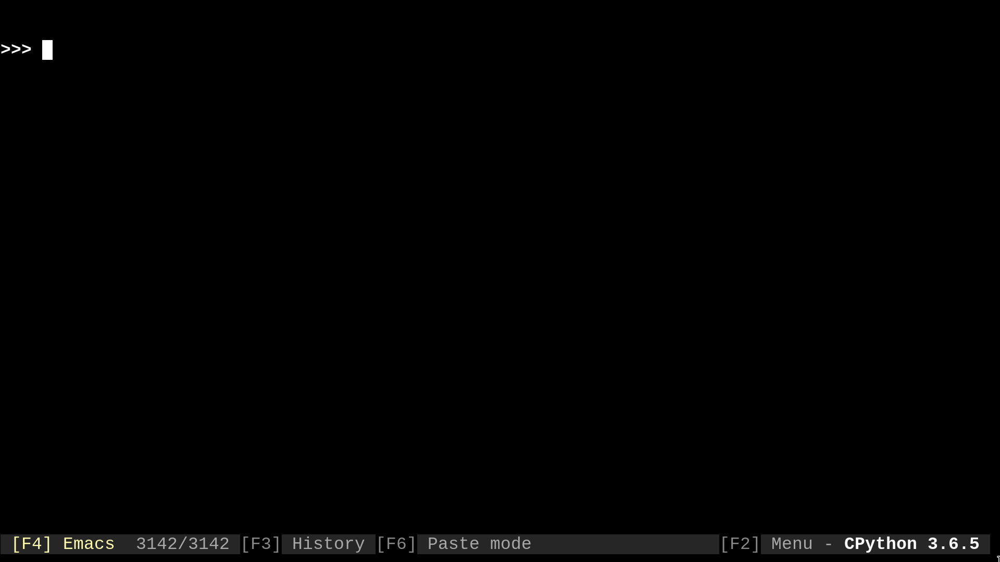

# clanim - Command Line Animations

[](https://travis-ci.org/slarse/clanim)
[](https://codecov.io/gh/slarse/clanim)
[](https://clanim.readthedocs.io/en/latest/)
[](https://badge.fury.io/py/clanim)
[](https://badge.fury.io/py/clanim)



### Overview
`clanim` is a collection of made command line animations that can easily
be applied to pretty much any (non-recursive) function. The animations are
built with the [`clanimtk`](https://github.com/slarse/clanimtk) package, and
are mostly meant to serve as examples of how to use it.

### Requirements

Python 3.6 or higher and the `clanimtk` package.

### Quickstart

Here are som minimal examples of using `clanim`:

```python
import time
from clanimtk import animate
from clanim import scrolling_text

# if no parameter is given, the default arrow animation is used
@animate
def slow(n):
    time.sleep(n)

# scrolling_text is a large, scrolling text animation
# step determines the time between frames
@animate(animation=scrolling_text("Crunching numbers ..."), step=0.05)
def fibo(n):
    if n < 0:
        raise ValueError("Undefined for n < 0")
    fibo_recursive(n)

# this recursive function must be wrapped in a non-recursive function
# before it can be animated
def fibo_recursive(n):
    if n == 0 or n == 1:
        return n
    return fibo(n-1) + fibo(n-2)
```

### Install

#### Option 1: Install from PyPi with `pip`

The latest release of `clanim` is on PyPi, and can thus be installed as with
`pip install clanim` (with your own preferred options, of course).

#### Option 2: Clone the repo and the install with `pip`

If you want the dev version, you will need to clone the repo, as only release
versions are uploaded to PyPi. Unless you are planning to work on this
yourself, I suggest going with the release version.

1. Clone the repo with `git`:
    - `git clone https://github.com/slarse/clanim`
2. `cd` into the project root directory and install with `pip`.
    - `pip install --user .`, this will create a local install for the current user.
    - Or just `pip install .` if you use `virtualenv`.
    - For development, use `pip install -e .` in a `virtualenv`.

### Wanted improvements

* Add more animations

### License

This software is licensed under the MIT License. See the [LICENSE](LICENSE)
file for specifics.

### Contributing

I will happily take contributions, especially in terms of new animations.
Submit a pull request if you have an idea, and let me approve the idea before
you put serious work into something I would not like in the project!
