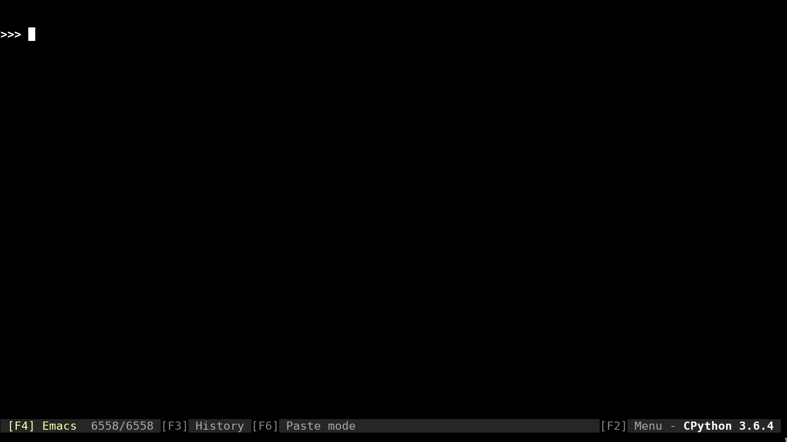

clanim - Command Line Animations
*******************************************************

`Docs`_

.. image:: https://travis-ci.org/slarse/clanim.svg?branch=master
    :target: https://travis-ci.org/slarse/clanim
    :alt: Build Status
.. image:: https://codecov.io/gh/slarse/clanim/branch/master/graph/badge.svg
    :target: https://codecov.io/gh/slarse/clanim
    :alt: Code Coverage
.. image:: https://readthedocs.org/projects/clanim/badge/?version=latest
    :target: http://clanim.readthedocs.io/en/latest/?badge=latest
    :alt: Documentation Status
.. image:: https://badge.fury.io/py/clanim.svg
    :target: https://badge.fury.io/py/clanim
    :alt: PyPi Version
.. image:: https://img.shields.io/badge/python-3.6-blue.svg
    :target: https://badge.fury.io/py/pdfebc
    :alt: Supported Python Versions

.. contents::

Overview
========
This package contains decorators for printing a command line animation while
the decorated function runs. It is very similar to the ``decorating`` package,
which currently has way more features and probably serves you better then
``clanim``. I wanted to create ``clanim`` anyway as a means of practicing
with decorators and command line animations. It doesn't seem like ``decorating`` 
currently supports async functions, so that's the one area where ``clanim`` 
potentially is superior at this time.

.. important::
    
    The API and general functionality of ``clanim`` is likely to change
    dramatically in the coming iterations. I have decided to change the purpose
    of the project and make it more of a toolkit for creating animations, than
    a ready-to-use animation library. I may split it into two packages, one
    with ready-to-use animations, and one with the tools needed to easily
    create new animations. There are also problems with incorrect use of the
    functools wraps decorator such that decorated a function's meta info is
    changed. This is solved in the dev version of the new project and will be
    made available when the rest of the overhaul is done.

Requirements
============
Python 3.6 or higher and the ``daiquiri`` package (used for development and
will probably be removed in a final release).

Quickstart
==========
The user API for clanim is contained wholly on the package level. That is to
say, only the imports available from ``clanim`` is intended for non-developers.
``clanim`` works both for regular functions, as well as async functions.
Most notably, there are the ``animate`` and ``annotate`` decorators. ``animate``
is the core decorator used to animate functions, and ``annotate`` is used to
display messages before and/or after an animated function.

.. DANGER::

    Print statements inside of a functions annotated with ``animate`` will
    interfere with the animation, so use ``annotate`` instead.

.. DANGER::

    Recursive functions are currently not supported! If you have a recursive
    function, you may wrap it in another (and animated) function which simply
    issues a call to the recursive function with the same arguments.

.. important::

    When using clanim to annotate async functions, it is very important that the
    event loop is exited properly. For example, an unhandled keyboard interrupt
    in the middle of an animated async function will cause the animation thread
    to keep spinning forever. Therefore, always put the starting of the even
    loop in a try block and make sure that the event loop is closed no matter
    what.

Here are som minimal examples:

.. code:: python

    import time
    from clanim import animate, scrolling_text

    # if no parameter is given, the default arrow animation is used
    @animate
    def slow(n):
        time.sleep(n)

    # scrolling_text is a large, scrolling text animation
    # step determines the time between frames
    @animate(animation=scrolling_text("Crunching numbers ..."), step=0.05)
    def fibo(n):
        if n < 0:
            raise ValueError("Undefined for n < 0")
        fibo_recursive(n)

    def fibo_recursive(n):
        if n == 0 or n == 1:
            return n
        return fibo(n-1) + fibo(n-2)

The biggest new addition to the 0.2.0 release is the ``scrolling_text``
animation, which is demonstrated below.

Install
=======
Option 1: Install from PyPi with ``pip``
----------------------------------------
The latest release of ``clanim`` is on PyPi, and can thus be installed as usual
with ``pip``.  I strongly discourage system-wide ``pip`` installs (i.e. ``sudo
pip install <package>``), as this may land you with incompatible packages in a
very short amount of time. A per-user install can be done like this:

1. Execute ``pip install --user clanim`` to install the package.
2. Further steps to be added ...

Option 2: Clone the repo and the install with ``pip``
-----------------------------------------------------
If you want the dev version, you will need to clone the repo, as only release
versions are uploaded to PyPi. Unless you are planning to work on this
yourself, I suggest going with the release version.

1. Clone the repo with ``git``:
    - ``git clone https://github.com/slarse/clanim``
2. ``cd`` into the project root directory and install with ``pip``.
    - ``pip install --user .``, this will create a local install for the current user.
    - Or just ``pip install .`` if you use ``virtualenv``.
    - For development, use ``pip install -e .`` in a ``virtualenv``.
3. Further steps to be added ...

Wanted improvements
===================
* Add more animations
* Decouple animation update from rendering
* Add support for recursive functions

License
=======
This software is licensed under the MIT License. See the `license file`_ file
for specifics.

Contributing
============
I will happily take contributions, especially in terms of new animations.
Submit a pull request if you have an idea, and let me approve the idea before
you put serious work into something I would not like in the project!

.. _license file: LICENSE
.. _setup.py: setup.py
.. _requirements.txt: requirements.txt
.. _Docs: https://clanim.readthedocs.io/en/latest/
